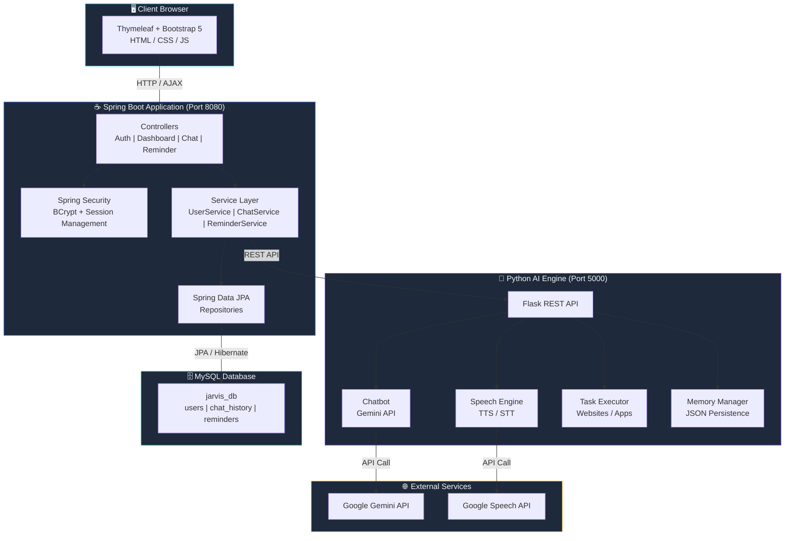
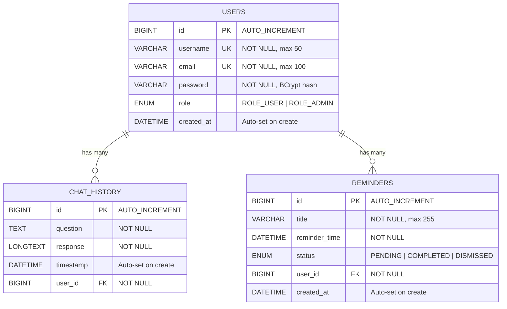
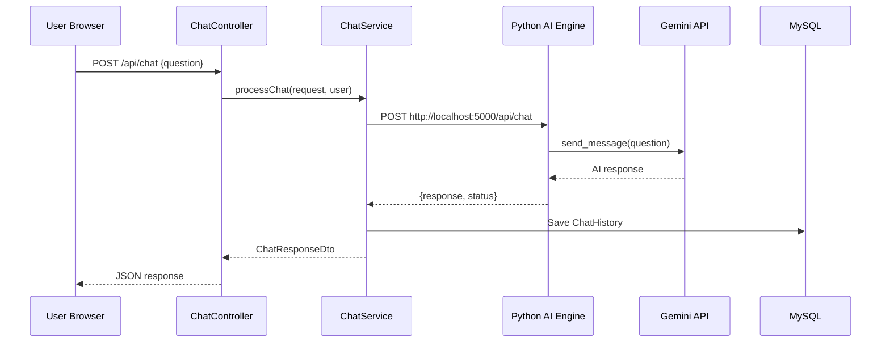
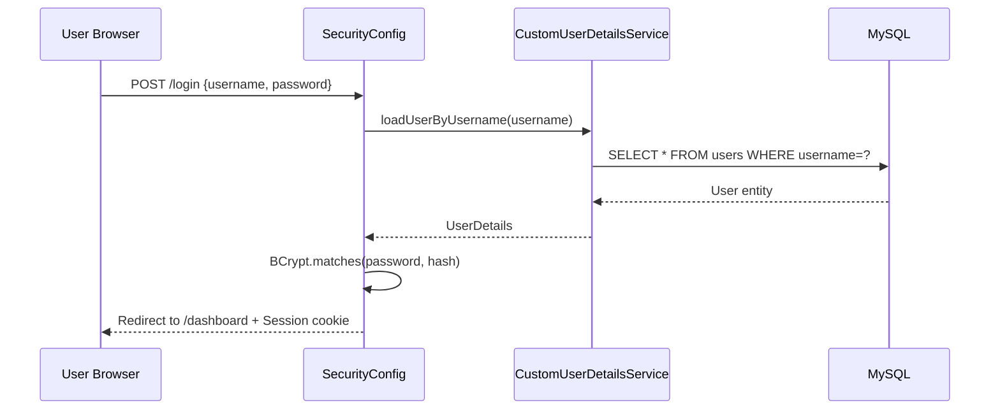

# JARVIS AI Assistant — Architecture

## System Architecture Diagram

---

## ER Diagram

---

## Component Overview

### Spring Boot Backend

| Component | Responsibility |
|-----------|---------------|
| **SecurityConfig** | Configures Spring Security filter chain, BCrypt encoder, form login, session management |
| **CustomUserDetailsService** | Loads user details from MySQL for authentication |
| **DataInitializer** | Seeds default admin user on first startup |
| **AuthController** | Handles login/register page rendering and form submission |
| **DashboardController** | Aggregates stats and recent activity for the dashboard |
| **ChatController** | Serves chat page and AJAX endpoints for messaging |
| **ReminderController** | Serves reminders page and full CRUD REST endpoints |
| **ChatService** | Bridges Spring Boot with the Python AI Engine via REST |
| **ReminderService** | Business logic for reminder lifecycle management |
| **UserService** | Registration with BCrypt encoding, admin bootstrapping |

### Python AI Engine

| Module | Responsibility |
|--------|---------------|
| **main.py** | Flask server, route definitions, module orchestration |
| **chatbot.py** | Gemini API integration with session management and fallback responses |
| **speech_engine.py** | Text-to-speech (pyttsx3) and speech-to-text (SpeechRecognition) |
| **task_executor.py** | Natural language command parsing, website/app launching |
| **memory_manager.py** | Thread-safe JSON persistence of conversation history |

---

## Data Flow

### Chat Message Flow

### Authentication Flow

---

## Security Architecture

- **Password Hashing**: BCrypt with strength 12
- **Session Management**: Server-side sessions with 30-minute timeout, single session per user
- **CSRF Protection**: Enabled by default, tokens passed via meta tags for AJAX requests
- **Public Paths**: `/login`, `/register`, `/css/**`, `/js/**`, `/actuator/health`
- **Protected Paths**: Everything else requires authentication
